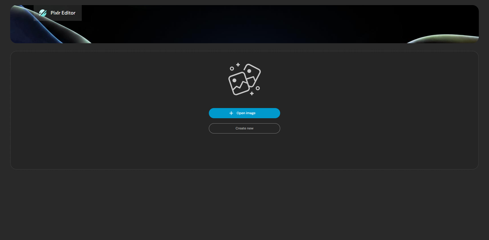
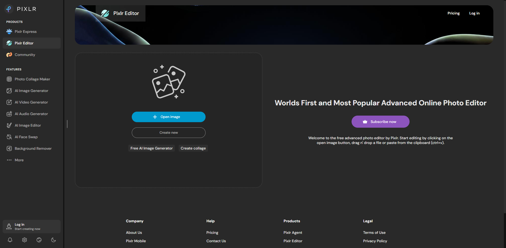
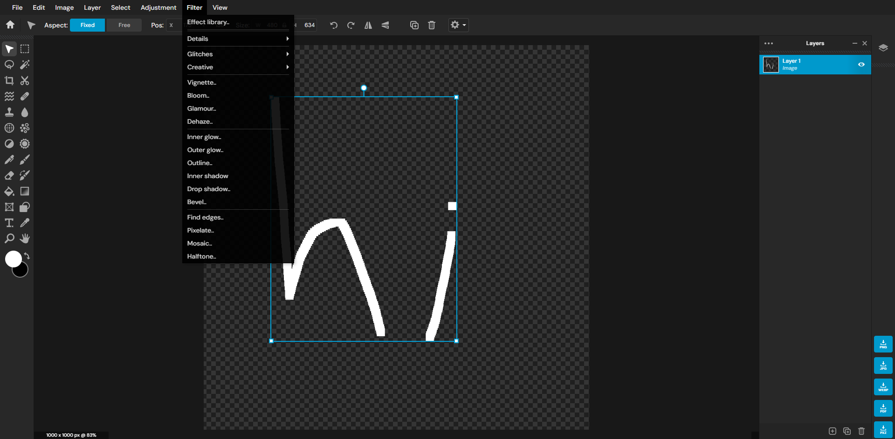
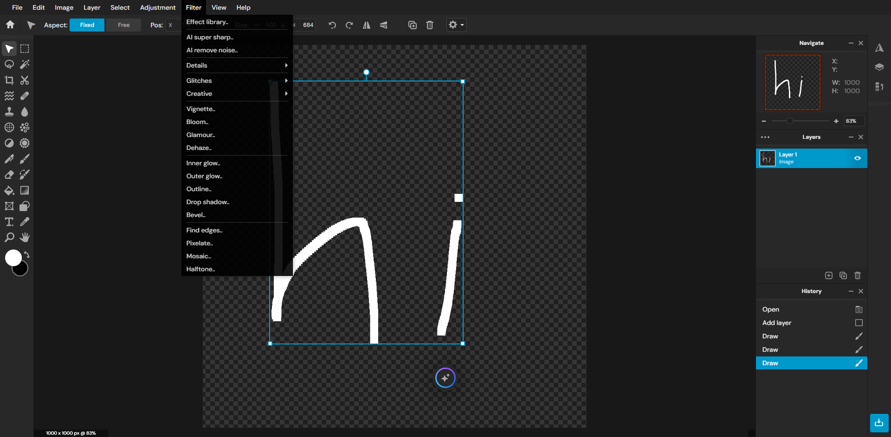

still has <b>missing/broken features</b>, + barely deobfuscated, so needs work
this skips the daily export limit, of course! it skips the export window altogether, hence why there are so many format download buttons to the right

<table>
	<tr>
		<td align="center">
			<h4>cleanup</h4>
		</td>
		<td align="center">
			<h4>original site</h4>
		</td>
	</tr>
	<tr>
		<td align="center">
			
		</td>
		<td align="center">
			
		</td>
	</tr>
	<tr>
		<td align="center">
			
		</td>
		<td align="center">
			
		</td>
	</tr>
</table>